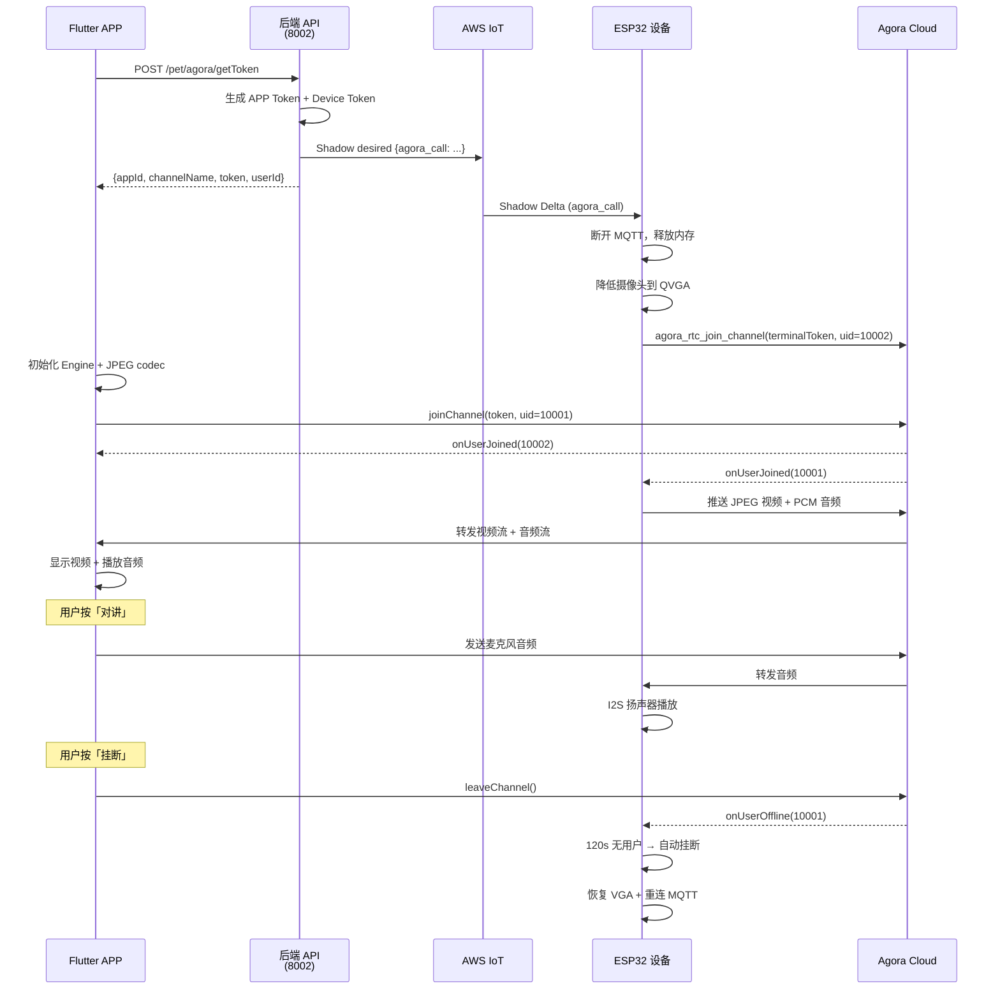

# iPet Flutter 端 Agora RTC 通话接入文档

## 1. 架构概览

```
┌──────────────┐       ┌──────────────┐       ┌──────────────┐
│  Flutter APP │◄─────►│  Agora Cloud │◄─────►│   ESP32 设备  │
│  (观看端)     │       │  (SDRTN)     │       │  (推流端)     │
│              │       │              │       │              │
│ Video SDK    │       │  频道路由     │       │ RTSA Lite SDK│
│ uid: 10001   │       │  信令转发     │       │ uid: 10002   │
│ codec: JPEG  │       │              │       │ JPEG + PCM   │
└──────────────┘       └──────────────┘       └──────────────┘
       │                                             │
       │          ┌──────────────┐                   │
       └─────────►│  后端 API    │◄──────────────────┘
                  │  port 8002   │    (AWS IoT Shadow)
                  │ /pet/agora/  │
                  │  getToken    │
                  └──────────────┘
```

> [!IMPORTANT]
> ESP32 使用 `VIDEO_DATA_TYPE_GENERIC_JPEG` 推流。**只有 Android 支持 JPEG 视频解码，iOS 不支持**。
> - Android: ✅ 可看到视频画面
> - iOS: ❌ 只能听到音频，看不到视频（需 ESP32 改用 H.264 才能解决）

---

## 2. 依赖配置

### pubspec.yaml
```yaml
dependencies:
  agora_rtc_engine: ^6.3.2    # Agora RTC SDK
  permission_handler: ^11.0.0  # 权限管理
  http: ^1.2.0                 # API 请求（或用 dio）
```

### Android 配置

**android/app/build.gradle**:
```groovy
android {
    defaultConfig {
        minSdkVersion 24  // Agora 最低要求
    }
}
```

**android/app/src/main/AndroidManifest.xml**:
```xml
<uses-permission android:name="android.permission.INTERNET" />
<uses-permission android:name="android.permission.CAMERA" />
<uses-permission android:name="android.permission.RECORD_AUDIO" />
<uses-permission android:name="android.permission.MODIFY_AUDIO_SETTINGS" />
<uses-permission android:name="android.permission.ACCESS_NETWORK_STATE" />
<uses-permission android:name="android.permission.BLUETOOTH" />
```

### iOS 配置

**ios/Runner/Info.plist**:
```xml
<key>NSCameraUsageDescription</key>
<string>iPet 需要使用摄像头与宠物视频通话</string>
<key>NSMicrophoneUsageDescription</key>
<string>iPet 需要使用麦克风与宠物语音对讲</string>
```

**ios/Podfile** (最低版本):
```ruby
platform :ios, '13.0'
```

---

## 3. API 调用流程

### 3.1 获取 Agora Token

```
POST /pet/agora/getToken
Header: token: <granwin_token>
Body: mac=ipet-esp32-Device-02&loginCustomerId=<userId>
```

**响应**:
```json
{
  "code": 0,
  "info": {
    "appId": "e3e1077ea9b74e93b327b01d4d2ba125",
    "channelName": "ipet-esp32-Device-02_1780380686909ipet-esp32-Device-02",
    "token": "007eJxTYLAI...",           // APP 端用的 token
    "userId": "10001",                    // APP 端 uid
    "terminalToken": "007eJxTYLB2...",   // 设备端用（后端自动下发 Shadow）
    "terminalUserId": "10002",           // 设备端 uid
    "license": "019E8348..."             // 设备 license
  }
}
```

> [!NOTE]
> 调用 `getToken` 后，**后端自动通过 AWS IoT Shadow 将通话参数下发给 ESP32**。
> APP 端只需用 `token` + `channelName` + `userId` 加入频道即可。

### 3.2 Dart 模型

```dart
class AgoraTokenInfo {
  final String appId;
  final String channelName;
  final String token;
  final int userId;

  AgoraTokenInfo({
    required this.appId,
    required this.channelName,
    required this.token,
    required this.userId,
  });

  factory AgoraTokenInfo.fromJson(Map<String, dynamic> json) {
    final info = json['info'] as Map<String, dynamic>;
    return AgoraTokenInfo(
      appId: info['appId'] as String,
      channelName: info['channelName'] as String,
      token: info['token'] as String,
      userId: int.parse(info['userId'] as String),
    );
  }
}
```

### 3.3 API 请求

```dart
import 'dart:convert';
import 'package:http/http.dart' as http;

class AgoraService {
  static const String _baseUrl = 'https://your-api-domain.com';

  /// 获取 Agora Token 并触发 ESP32 加入频道
  static Future<AgoraTokenInfo> getToken({
    required String authToken,
    required String mac,       // 设备 MAC，如 "ipet-esp32-Device-02"
    required String customerId,
  }) async {
    final response = await http.post(
      Uri.parse('$_baseUrl/pet/agora/getToken'),
      headers: {'token': authToken},
      body: {
        'mac': mac,
        'loginCustomerId': customerId,
      },
    );

    final data = json.decode(response.body);
    if (data['code'] != 0) {
      throw Exception('获取 Token 失败: ${data['tip']}');
    }
    return AgoraTokenInfo.fromJson(data);
  }
}
```

---

## 4. Agora 引擎管理

### 4.1 核心类

```dart
import 'dart:io';
import 'package:agora_rtc_engine/agora_rtc_engine.dart';
import 'package:permission_handler/permission_handler.dart';

class AgoraCallManager {
  RtcEngine? _engine;
  bool _isJoined = false;
  int? _remoteUid;

  // 回调
  Function(int uid)? onRemoteUserJoined;
  Function(int uid)? onRemoteUserLeft;
  Function(String error)? onError;
  Function()? onJoinSuccess;

  /// 初始化引擎
  Future<void> initialize(String appId) async {
    // 1. 请求权限
    await _requestPermissions();

    // 2. 创建引擎
    _engine = createAgoraRtcEngine();
    await _engine!.initialize(RtcEngineContext(
      appId: appId,
      channelProfile: ChannelProfileType.channelProfileLiveBroadcasting,
    ));

    // 3. ⭐ 关键：设置 JPEG 解码（仅 Android 有效）
    if (Platform.isAndroid) {
      await _engine!.setParameters('{"engine.video.codec_type": "20"}');
    }

    // 4. 启用音视频
    await _engine!.enableVideo();
    await _engine!.enableAudio();

    // 5. 设置音频为 IoT 模式（低带宽优化）
    await _engine!.setAudioProfile(
      profile: AudioProfileType.audioProfileDefault,
      scenario: AudioScenarioType.audioScenarioChatroom,
    );

    // 6. 注册事件
    _engine!.registerEventHandler(RtcEngineEventHandler(
      onJoinChannelSuccess: (connection, elapsed) {
        _isJoined = true;
        onJoinSuccess?.call();
      },
      onUserJoined: (connection, remoteUid, elapsed) {
        _remoteUid = remoteUid;
        onRemoteUserJoined?.call(remoteUid);
      },
      onUserOffline: (connection, remoteUid, reason) {
        _remoteUid = null;
        onRemoteUserLeft?.call(remoteUid);
      },
      onError: (err, msg) {
        onError?.call('Agora Error: $err - $msg');
      },
      onTokenPrivilegeWillExpire: (connection, token) {
        // TODO: 刷新 Token
        onError?.call('Token 即将过期，请刷新');
      },
      onConnectionLost: (connection) {
        onError?.call('连接丢失');
      },
    ));
  }

  /// 加入频道（观众模式 - 看设备画面 + 说话）
  Future<void> joinChannel({
    required String channelName,
    required String token,
    required int uid,
    bool enableMicrophone = false,  // 是否开启麦克风（对讲）
  }) async {
    if (_engine == null) throw Exception('引擎未初始化');

    // 设置角色：
    // - broadcaster: 可以发送音频（对讲）+ 接收视频
    // - audience: 只接收，不发送
    if (enableMicrophone) {
      await _engine!.setClientRole(
        role: ClientRoleType.clientRoleBroadcaster,
      );
      await _engine!.enableLocalAudio(true);
      await _engine!.muteLocalAudioStream(false);
    } else {
      await _engine!.setClientRole(
        role: ClientRoleType.clientRoleAudience,
      );
    }

    // 不发送本地视频（APP 摄像头不需要给宠物看）
    await _engine!.enableLocalVideo(false);

    // 加入频道
    await _engine!.joinChannel(
      token: token,
      channelId: channelName,
      uid: uid,
      options: const ChannelMediaOptions(
        autoSubscribeVideo: true,   // 自动订阅设备视频
        autoSubscribeAudio: true,   // 自动订阅设备音频
        publishCameraTrack: false,  // 不发送摄像头
        publishMicrophoneTrack: true, // 发送麦克风（对讲时）
      ),
    );
  }

  /// 切换麦克风（对讲开关）
  Future<void> toggleMicrophone(bool enable) async {
    if (_engine == null) return;

    if (enable) {
      await _engine!.setClientRole(
        role: ClientRoleType.clientRoleBroadcaster,
      );
      await _engine!.enableLocalAudio(true);
      await _engine!.muteLocalAudioStream(false);
    } else {
      await _engine!.muteLocalAudioStream(true);
    }
  }

  /// 切换扬声器/听筒
  Future<void> setSpeakerphone(bool enable) async {
    await _engine?.setEnableSpeakerphone(enable);
  }

  /// 调节远端音量 (0-100)
  Future<void> adjustRemoteVolume(int volume) async {
    if (_remoteUid != null) {
      await _engine?.adjustUserPlaybackSignalVolume(
        uid: _remoteUid!,
        volume: volume,
      );
    }
  }

  /// 离开频道
  Future<void> leaveChannel() async {
    await _engine?.leaveChannel();
    _isJoined = false;
    _remoteUid = null;
  }

  /// 销毁引擎
  Future<void> dispose() async {
    await _engine?.leaveChannel();
    await _engine?.release();
    _engine = null;
  }

  /// 获取远端视频 Widget
  Widget? getRemoteVideoView(String channelName) {
    if (_remoteUid == null || _engine == null) return null;

    return AgoraVideoView(
      controller: VideoViewController.remote(
        rtcEngine: _engine!,
        canvas: VideoCanvas(uid: _remoteUid!),
        connection: RtcConnection(channelId: channelName),
      ),
    );
  }

  /// 权限请求
  Future<void> _requestPermissions() async {
    await [
      Permission.microphone,
      Permission.camera,  // 虽然不用摄像头，但 SDK 初始化需要
    ].request();
  }

  bool get isJoined => _isJoined;
  int? get remoteUid => _remoteUid;
  RtcEngine? get engine => _engine;
}
```

---

## 5. 通话 UI 页面

```dart
import 'package:flutter/material.dart';
import 'agora_call_manager.dart';
import 'agora_service.dart';

class PetCallPage extends StatefulWidget {
  final String authToken;
  final String deviceMac;
  final String customerId;

  const PetCallPage({
    required this.authToken,
    required this.deviceMac,
    required this.customerId,
    super.key,
  });

  @override
  State<PetCallPage> createState() => _PetCallPageState();
}

class _PetCallPageState extends State<PetCallPage> {
  final AgoraCallManager _callManager = AgoraCallManager();

  bool _isConnecting = true;
  bool _isMicOn = false;
  bool _isSpeakerOn = true;
  String? _errorMessage;
  String? _channelName;
  int? _remoteUid;

  @override
  void initState() {
    super.initState();
    _startCall();
  }

  Future<void> _startCall() async {
    try {
      // 1. 获取 Token（同时触发 ESP32 加入频道）
      final tokenInfo = await AgoraService.getToken(
        authToken: widget.authToken,
        mac: widget.deviceMac,
        customerId: widget.customerId,
      );
      _channelName = tokenInfo.channelName;

      // 2. 初始化 Agora 引擎
      _callManager.onRemoteUserJoined = (uid) {
        setState(() => _remoteUid = uid);
      };
      _callManager.onRemoteUserLeft = (uid) {
        setState(() => _remoteUid = null);
      };
      _callManager.onJoinSuccess = () {
        setState(() => _isConnecting = false);
      };
      _callManager.onError = (error) {
        setState(() => _errorMessage = error);
      };

      await _callManager.initialize(tokenInfo.appId);

      // 3. 加入频道
      await _callManager.joinChannel(
        channelName: tokenInfo.channelName,
        token: tokenInfo.token,
        uid: tokenInfo.userId,
        enableMicrophone: false,  // 默认关闭麦克风
      );

      // 4. 默认开启扬声器
      await _callManager.setSpeakerphone(true);
    } catch (e) {
      setState(() {
        _isConnecting = false;
        _errorMessage = e.toString();
      });
    }
  }

  @override
  void dispose() {
    _callManager.dispose();
    super.dispose();
  }

  @override
  Widget build(BuildContext context) {
    return Scaffold(
      backgroundColor: Colors.black,
      body: Stack(
        children: [
          // ---- 视频画面 ----
          _buildVideoView(),

          // ---- 顶部信息栏 ----
          Positioned(
            top: MediaQuery.of(context).padding.top + 10,
            left: 16,
            right: 16,
            child: Row(
              children: [
                // 返回按钮
                IconButton(
                  icon: const Icon(Icons.arrow_back, color: Colors.white),
                  onPressed: () => Navigator.pop(context),
                ),
                const Spacer(),
                // 连接状态
                Container(
                  padding: const EdgeInsets.symmetric(
                    horizontal: 12, vertical: 6,
                  ),
                  decoration: BoxDecoration(
                    color: _remoteUid != null
                        ? Colors.green.withOpacity(0.8)
                        : Colors.orange.withOpacity(0.8),
                    borderRadius: BorderRadius.circular(20),
                  ),
                  child: Text(
                    _remoteUid != null ? '● 已连接' : '○ 等待设备...',
                    style: const TextStyle(color: Colors.white, fontSize: 14),
                  ),
                ),
              ],
            ),
          ),

          // ---- 底部控制栏 ----
          Positioned(
            bottom: MediaQuery.of(context).padding.bottom + 30,
            left: 0,
            right: 0,
            child: Row(
              mainAxisAlignment: MainAxisAlignment.spaceEvenly,
              children: [
                // 麦克风（对讲）
                _buildControlButton(
                  icon: _isMicOn ? Icons.mic : Icons.mic_off,
                  label: _isMicOn ? '对讲中' : '对讲',
                  isActive: _isMicOn,
                  onPressed: () async {
                    _isMicOn = !_isMicOn;
                    await _callManager.toggleMicrophone(_isMicOn);
                    setState(() {});
                  },
                ),

                // 扬声器
                _buildControlButton(
                  icon: _isSpeakerOn
                      ? Icons.volume_up
                      : Icons.volume_off,
                  label: _isSpeakerOn ? '扬声器' : '静音',
                  isActive: _isSpeakerOn,
                  onPressed: () async {
                    _isSpeakerOn = !_isSpeakerOn;
                    await _callManager.setSpeakerphone(_isSpeakerOn);
                    setState(() {});
                  },
                ),

                // 挂断
                _buildControlButton(
                  icon: Icons.call_end,
                  label: '挂断',
                  isActive: false,
                  isHangup: true,
                  onPressed: () async {
                    await _callManager.leaveChannel();
                    if (mounted) Navigator.pop(context);
                  },
                ),
              ],
            ),
          ),

          // ---- 错误提示 ----
          if (_errorMessage != null)
            Positioned(
              bottom: 150,
              left: 20,
              right: 20,
              child: Container(
                padding: const EdgeInsets.all(12),
                decoration: BoxDecoration(
                  color: Colors.red.withOpacity(0.8),
                  borderRadius: BorderRadius.circular(8),
                ),
                child: Text(
                  _errorMessage!,
                  style: const TextStyle(color: Colors.white),
                  textAlign: TextAlign.center,
                ),
              ),
            ),
        ],
      ),
    );
  }

  Widget _buildVideoView() {
    if (_isConnecting) {
      return const Center(
        child: Column(
          mainAxisSize: MainAxisSize.min,
          children: [
            CircularProgressIndicator(color: Colors.white),
            SizedBox(height: 16),
            Text('正在连接...', style: TextStyle(color: Colors.white70)),
          ],
        ),
      );
    }

    if (_remoteUid != null && _channelName != null) {
      final videoView = _callManager.getRemoteVideoView(_channelName!);
      if (videoView != null) return videoView;
    }

    return const Center(
      child: Column(
        mainAxisSize: MainAxisSize.min,
        children: [
          Icon(Icons.pets, size: 80, color: Colors.white24),
          SizedBox(height: 16),
          Text(
            '等待宠物设备连接...',
            style: TextStyle(color: Colors.white54, fontSize: 18),
          ),
        ],
      ),
    );
  }

  Widget _buildControlButton({
    required IconData icon,
    required String label,
    required bool isActive,
    required VoidCallback onPressed,
    bool isHangup = false,
  }) {
    return Column(
      mainAxisSize: MainAxisSize.min,
      children: [
        GestureDetector(
          onTap: onPressed,
          child: Container(
            width: 60,
            height: 60,
            decoration: BoxDecoration(
              shape: BoxShape.circle,
              color: isHangup
                  ? Colors.red
                  : isActive
                      ? Colors.green
                      : Colors.white.withOpacity(0.2),
            ),
            child: Icon(icon, color: Colors.white, size: 28),
          ),
        ),
        const SizedBox(height: 8),
        Text(
          label,
          style: const TextStyle(color: Colors.white70, fontSize: 12),
        ),
      ],
    );
  }
}
```

---

## 6. 调用入口

```dart
// 从设备详情页进入通话
Navigator.push(
  context,
  MaterialPageRoute(
    builder: (_) => PetCallPage(
      authToken: userToken,                // 登录获取的 granwin_token
      deviceMac: 'ipet-esp32-Device-02',   // 设备 MAC
      customerId: 'testuser',              // 用户 ID
    ),
  ),
);
```

---

## 7. 平台差异与注意事项

### 7.1 Android vs iOS 视频兼容性

```dart
// 在初始化后检查平台
if (Platform.isAndroid) {
  // ✅ Android 支持 JPEG，设置 codec_type=20
  await engine.setParameters('{"engine.video.codec_type": "20"}');
} else if (Platform.isIOS) {
  // ❌ iOS 不支持 JPEG
  // 方案 1: 只用音频（对讲），不显示视频
  // 方案 2: 使用 MJPEG HTTP 流替代（通过 SIM7600 4G 转发）
  // 方案 3: 等 ESP32 改为 H.264 编码
  showDialog(
    context: context,
    builder: (_) => AlertDialog(
      title: Text('提示'),
      content: Text('iOS 暂不支持视频预览，仅支持语音对讲'),
    ),
  );
}
```

### 7.2 通话生命周期

```
用户点击「查看宠物」
  │
  ├── 1. 调 API getToken（后端自动 Shadow 下发给 ESP32）
  │
  ├── 2. 初始化 Agora Engine + setParameters JPEG
  │
  ├── 3. joinChannel (audience 模式)
  │      │
  │      ├── ESP32 收到 Shadow → 加入同一频道 → 推流
  │      │
  │      ├── onUserJoined(10002) → 显示视频
  │      │
  │      └── 用户按「对讲」→ 切换 broadcaster → 发送音频
  │
  └── 4. 用户按「挂断」或返回
         │
         ├── leaveChannel()
         ├── engine.release()
         │
         └── ESP32 检测到 remoteUid 离开 → 120s 无人 → 自动挂断
```

### 7.3 音频配置说明

| 场景 | ESP32 | APP |
|------|-------|-----|
| ESP32 → APP（听宠物声音） | 麦克风采集 PCM → Agora SDK 发送 | 自动接收 + 扬声器播放 |
| APP → ESP32（对讲/喊话） | Agora SDK 接收 → I2S 扬声器播放 | 麦克风采集 → Agora SDK 发送 |

> [!WARNING]
> ESP32 RTSA Lite SDK 不包含 OPUS 编码器。音频使用 `AUDIO_CODEC_DISABLED` + `AUDIO_DATA_TYPE_PCM` 直发。
> Agora 服务端会自动转码，APP 端默认 OPUS 即可，**无需额外配置音频编解码**。

### 7.4 错误处理

| 错误码 | 说明 | 处理 |
|--------|------|------|
| `ERR_TOKEN_EXPIRED` | Token 过期 | 重新调 getToken |
| `ERR_INVALID_TOKEN` | Token 无效 | 检查 channelName 是否匹配 |
| Connection Lost | 网络断开 | 提示用户检查网络 |
| `onUserOffline(10002)` | 设备离线 | 提示"设备已断开" |

### 7.5 Token 刷新

Token 有效期约 24 小时。监听 `onTokenPrivilegeWillExpire`：

```dart
onTokenPrivilegeWillExpire: (connection, token) async {
  // 重新获取 token
  final newToken = await AgoraService.getToken(
    authToken: widget.authToken,
    mac: widget.deviceMac,
    customerId: widget.customerId,
  );
  // 续期
  await _engine?.renewToken(newToken.token);
},
```

---

## 8. 完整调用时序



---

## 9. 快速验证清单

- [ ] `pubspec.yaml` 添加 `agora_rtc_engine` 依赖
- [ ] Android `minSdkVersion >= 24`
- [ ] Android Manifest 添加权限
- [ ] iOS Info.plist 添加麦克风/摄像头描述
- [ ] API `/pet/agora/getToken` 返回正确
- [ ] `setParameters('{"engine.video.codec_type": "20"}')` 在 Android 设置
- [ ] 加入频道后 `onUserJoined(10002)` 触发
- [ ] 视频画面正常显示（仅 Android）
- [ ] 对讲功能正常（双向音频）
- [ ] 挂断后 ESP32 自动恢复 MQTT
