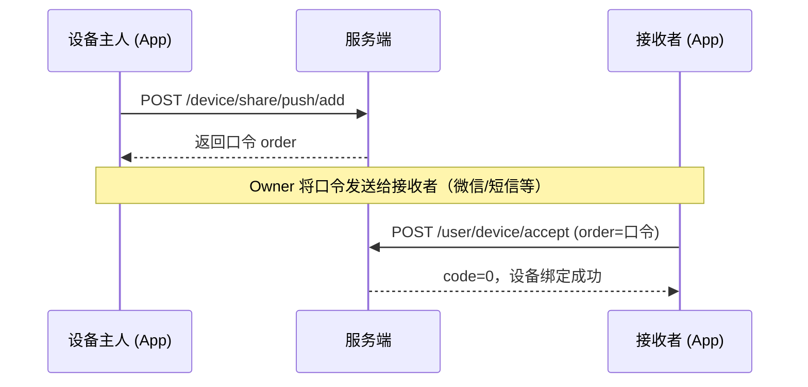

# iPet 设备口令分享 API 接入文档

## 概述

设备 Owner 创建分享后直接获得口令码，将口令发给接收者，接收者输入口令即可绑定设备。

### 流程



---

## 通用说明

### 基础 URL
```
http://<server>:8002
```

### 认证
所有接口需在 Header 中携带 `token`：
```
POST /user/login
参数: account=<邮箱>&password=<密码>&loginType=1
返回: {"code": 0, "info": {"ipet_token": "<token>"}}
```
后续请求 Header: `token: <ipet_token>`

### 通用响应
```json
{"code": 0, "tip": "响应成功"}
```
`code=0` 为成功，非 0 为失败。

---

## 核心接口

### 1. 创建分享（Owner）

生成口令码，返回给 App 展示。

```
POST /device/share/push/add
```

| 参数 | 类型 | 必填 | 说明 |
|------|------|------|------|
| deviceId | Long | ✅ | 设备 ID（从设备列表获取） |
| email | String | ✅ | 接收者的注册邮箱 |
| type | Integer | ✅ | 权限类型，固定传 `3`（成员） |

**请求**
```bash
curl -X POST "/device/share/push/add" \
  -d "email=receiver@example.com&deviceId=1230394665731887104&type=3" \
  -H "token: <owner_token>"
```

**响应**
```json
{
  "code": 0,
  "info": {
    "order": "D1_9ciyia9rwkqo_A2D04A81C4999BFFDEB6032DD718BBB1"
  },
  "tip": "响应成功"
}
```

> [!IMPORTANT]
> `info.order` 就是口令码，App 展示给用户复制/分享。

| 错误码 | 说明 |
|--------|------|
| 0 | 成功 |
| 12021 | 设备不存在 |
| 12033 | 已发送过邀请（24h 内不可重复） |

---

### 2. 接受分享（接收者）

接收者输入口令码，将设备添加到自己账户。

```
POST /user/device/accept
```

| 参数 | 类型 | 必填 | 说明 |
|------|------|------|------|
| order | String | ✅ | 口令码 |

**请求**
```bash
curl -X POST "/user/device/accept" \
  -d "order=D1_9ciyia9rwkqo_A2D04A81C4999BFFDEB6032DD718BBB1" \
  -H "token: <receiver_token>"
```

**响应**
```json
{
  "code": 0,
  "tip": "响应成功"
}
```

| 错误码 | 说明 |
|--------|------|
| 0 | 成功，设备已绑定 |
| 2326 | 口令无效或已过期（24h） |
| 12021 | 设备不存在 |

> [!NOTE]
> 成功后接收者设备列表中 `uType=3`（成员），`sharer=<owner_id>`。

---

### 3. 查看成员列表（Owner）

```
POST /user/device/member/query
```

| 参数 | 类型 | 必填 | 说明 |
|------|------|------|------|
| mac | String | ✅ | 设备 MAC |

**响应**
```json
{
  "code": 0,
  "info": [
    {"userId": 1, "account": "user001", "username": "TestUser", "type": "1"},
    {"userId": 1214421015901298688, "account": "receiver@example.com", "username": "Receiver", "type": "1"}
  ]
}
```

---

### 4. 移除成员（Owner）

```
POST /user/device/member/remove
```

| 参数 | 类型 | 必填 | 说明 |
|------|------|------|------|
| deviceId | Long | ✅ | 设备 ID |
| userId | Long | ✅ | 要移除的用户 ID（来自 member/query） |

**响应**
```json
{
  "code": 0,
  "tip": "响应成功"
}
```

| 错误码 | 说明 |
|--------|------|
| 0 | 成功 |
| 12014 | 目标用户未绑定该设备 |

---

## 辅助接口

### 查看设备列表

```
POST /user/device/list
参数: prop=0
```

**响应**
```json
{
  "code": 0,
  "info": [
    {
      "mac": "ipet-esp32-Device-02",
      "deviceId": "1230394665731887104",
      "uType": "3",
      "sharer": "1",
      "deviceNickname": "机器人",
      "connect": true
    }
  ]
}
```

| 字段 | 说明 |
|------|------|
| `uType` | `1` = Owner, `3` = Member |
| `sharer` | 分享者用户 ID，`0` = 自己绑定 |

---

## 完整调用示例

```bash
SERVER="http://localhost:8002"

# Owner 登录
TK_OWNER=$(curl -s "$SERVER/user/login" -X POST \
  -d "account=user001&password=123456&loginType=1" | jq -r '.info.ipet_token')

# 获取设备 ID
DEVICE_ID=$(curl -s "$SERVER/user/device/list" -X POST \
  -d "prop=0" -H "token: $TK_OWNER" | jq -r '.info[0].deviceId')

# ① 创建分享 → 拿到口令
ORDER=$(curl -s "$SERVER/device/share/push/add" -X POST \
  -d "email=receiver@example.com&deviceId=$DEVICE_ID&type=3" \
  -H "token: $TK_OWNER" | jq -r '.info.order')
echo "口令: $ORDER"

# ② 接收者登录 + 接受分享
TK_RECV=$(curl -s "$SERVER/user/login" -X POST \
  -d "account=receiver@example.com&password=xxx&loginType=1" | jq -r '.info.ipet_token')

curl -s "$SERVER/user/device/accept" -X POST \
  -d "order=$ORDER" -H "token: $TK_RECV"
# → {"code":0,"tip":"响应成功"}
```

---

## 注意事项

> [!IMPORTANT]
> - 口令有效期 **24 小时**，过期需重新创建
> - 同一设备对同一用户 24h 内只能发一次邀请，重复返回 `12033`
> - 接收者必须是**已注册用户**

> [!NOTE]
> - `type=3` = MEMBER 权限，可查看/控制设备，不可管理成员
> - 移除成员后设备自动从该用户列表消失
